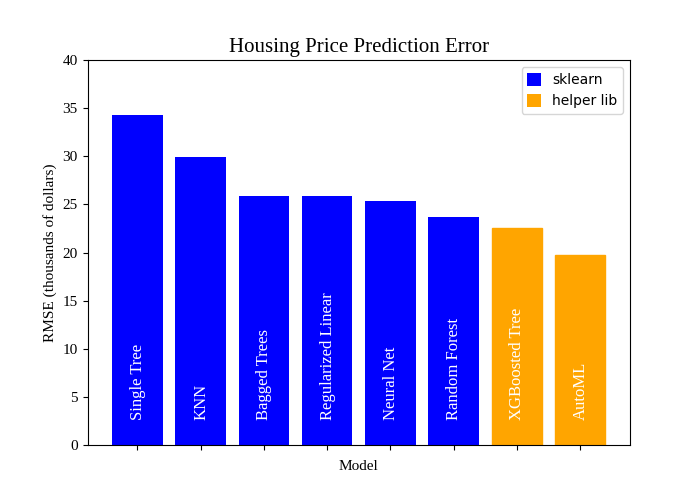

# Title
Better Modeling with Sklearn Companion Libs
# Subtitle
Write cleaner pipeline code, validate faster, and explore new models like AutoML from the comfort of your *Sklearn* skillset

# Motivation
I found a few Sklearn insights during a machine learning deep dive last year (see Sources). An informal poll of working data scientists revealed that these are not widely known. Hopefully, new and experienced readers will find something useful. 

Insights are demonstrated on the Ames housing data set.

Let's get to it.

### Streamlined pipeline code with Feature Engine's **SklearnTransformWrapper**

After ingestion and creating a train-test split, we construct preprocessing recipes called **Pipelines** to automate our preprocessing steps such as scaling and one-hot encoding. These are easy to read and guard against subtle data leakage during K-Fold validation.

Feature Engine's *SklearnTransformWrapper* wraps our StandardScaler() and OneHotEncoder() so that we can put them directly into our Pipeline object. No more ColumnTransformer. Sklearn's *make_pipeline* names the steps for us. 

GridSearchCV tunes the hyperparameters through the name of each step. 

PIPELINE GIST

### Fast and pretty model validation plots with Yellowbrick

*Yellowbrick* has helper classes and functions to automatically create various important graphics and keep our thinking (mostly) up above the matplotlib api.**

Your hyperparameter search with GridSearchCV may have covered multiple parameters. Choose one and validate it with Yellowbrick's **ValidationCurve** to make sure things look OK. 

YELLOWBRICK VALIDATION CURVE GIST

### Add AutoML and Extreme Gradient Boosting to your algorithm toolbox with AutoSklearn and XGBoost
Sklearn has estimators for everything from regularized regression, to support vector machine, single decision trees, bagged trees, boosted trees, and deep neural nets. Yet XGBoost is widely used in industry, and AutoML is very powerful. 

XGBOOST GIST

AUTOML GIST

### Place ingestion and feature engineering code in an ingestion script  
Hopefully obvious by now, but place your code that produces ready-to-model pandas dataframes into a script like **ingestion.py** and call it from all your notebooks and scripts. Good names for this function are "make_frames" and "make_cleaned". This way, ingestion or feature engineering code only needs to be changed in one place. Dependent code can simply be re-executed. 

INGESTION SCRIPT GIST

# Companion lib review
* Feature-Engine - provides simpler tranformers, reducing boilerplate and tightening up pipelines
* Yellowbrick - provides wrappers over estimators to make common visualizations quickly
* XGBoost - provides an additional (and widely popular) gradient boosting implementation
* AutoSklearn - provides AutoML functionality

# Sources
1. Georgetown Data Science Certificate Program
1. Hands-on Machine Learning with R book, Boehmke and Greenwell
1. Vectors Matrices and Least Squares book, Boyd and Vandenberghe
1. ThinkStats
1. API docs and code for the various libraries Sklearn, Xgboost, AutoSklearn, Numpy, Pandas
